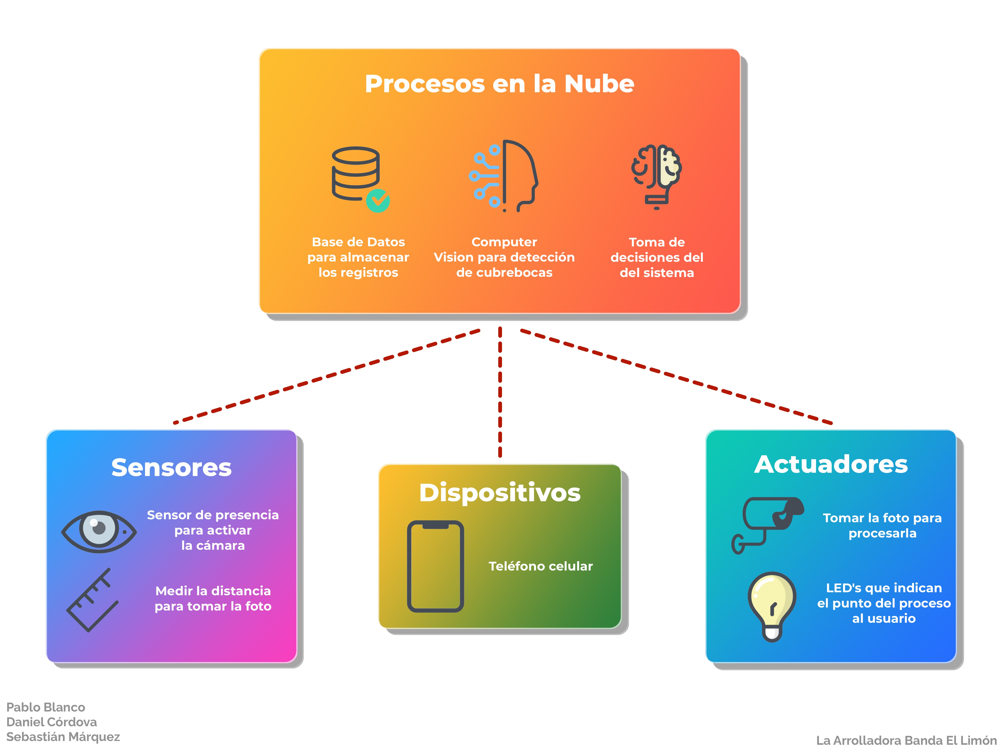
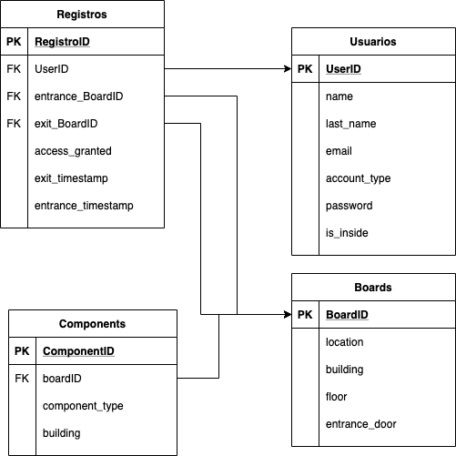
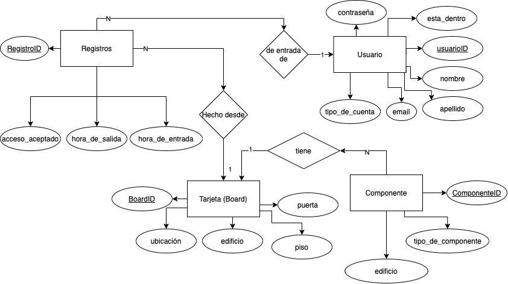

# Repositorio de la implementación del reto de IoT

# Ir a sección:
* Autores
* Estructura del proyecto
* Diagramas para la base de datos

___

## Autores:
* [Pablo Blanco](https://github.com/pablo-blancoc)
* [Daniel Córdova](https://github.com/DanielCordovaV)
* [Sebastián Márquez](https://github.com/ShadowsOfAiur)

___

## Estructura del proyecto

### Interacción de componentes del proyecto 

### Diagrama de flujo del proyecto 

___

## Modelos para el desarrollo de bases de datos

### Modelo Relacional

### Modelo de Entidad-Relación

