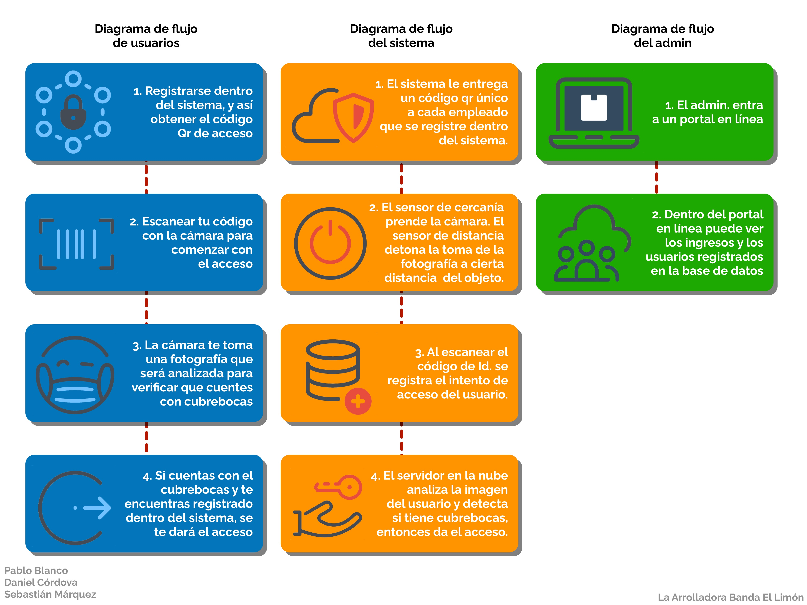

# Repositorio de la implementación del reto de IoT

___

## Ir a sección:
* [Autores](#autores)
* [Bitácora del proyecto](https://github.com/pablo-blancoc/Reto-IoT/tree/master/docs/bitacora)
* [Project Management](https://github.com/pablo-blancoc/Reto-IoT/tree/master/docs/project-management)
* [Estructura del proyecto](#estructura-del-proyecto)
* [Diagramas para la base de datos](#diagramas-para-el-desarrollo-de-bases-de-datos)

___

___

## Autores:
* [Pablo Blanco](https://github.com/pablo-blancoc)
* [Daniel Córdova](https://github.com/DanielCordovaV)
* [Sebastián Márquez](https://github.com/ShadowsOfAiur)

___

## Estructura del proyecto

### Interacción de componentes del proyecto 

### Diagrama de flujo del proyecto 

___

## Diagramas para el desarrollo de bases de datos

### Modelo Relacional

### Modelo de Entidad-Relación

